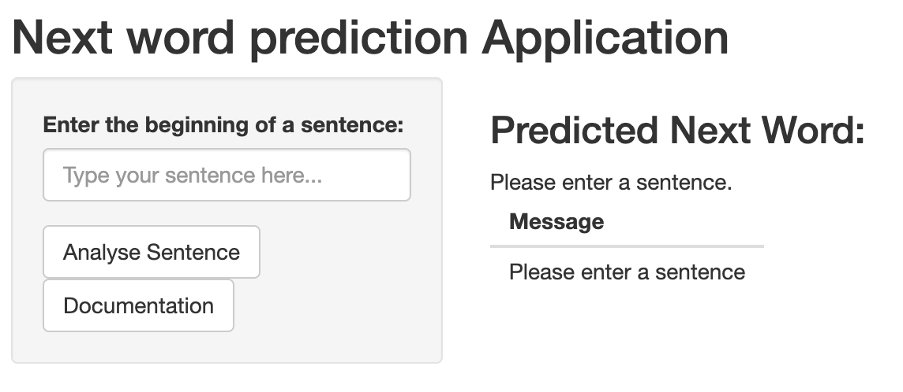
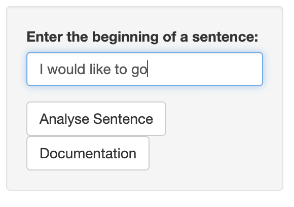
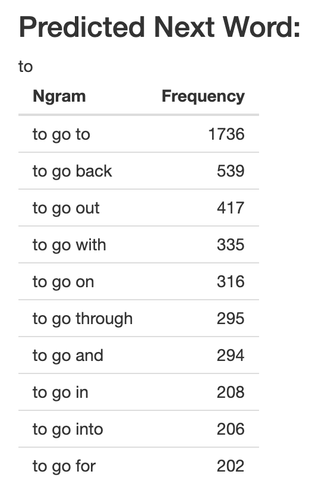
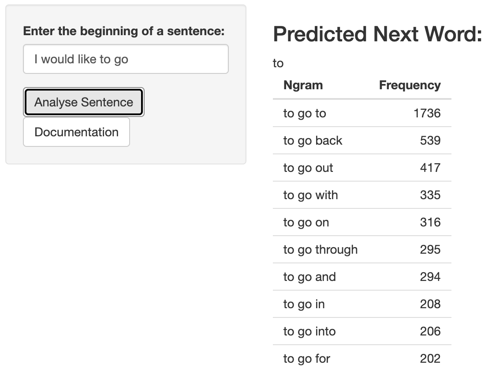

## Introduction

```{r libraries, echo=FALSE, error=FALSE, warning=FALSE, message=FALSE}
library(dplyr)
library(ggplot2)
library(gridExtra)
library(lubridate)
library(utils)
library(tidyr)
library(lexicon)
library(stringi)
library(quanteda) #package for corpus

#unigrams_df <- readRDS("./WordPredictionApp/unigrams_df.rds")
#bigrams_df <- readRDS("./WordPredictionApp/bigrams_df.rds")
#trigrams_df <- readRDS("./WordPredictionApp/trigrams_df.rds")
#tetragrams_df <- readRDS("./WordPredictionApp/tetragrams_df.rds")

```


Natural Language Processing is an important field in computer science where one is interested in processing, treating and working on natural language data. Various tasks accomplished in this field cover speech recognition, text classification, handwriting recognition, and many more. 

In this work, we are particularly interested in the **Next Word Prediction task**, which is the aim of this application. More precisely, this small application uses the **n-gram language model principle**, a pure statistical model, which tries to predict the most likely next word of a text. The concept of this model is based on the assumption that the probability of the next word is only dependent of a fixed number of previous words. 

The idea behind the application is simple: It lets the user enter the words of his choice in the dedicated space, then searches for a possible next word in its n-gram dictionaries. The user is invited to try it out on as many sentences as he wishes to. 

The application can be found on the following webpage, hosted by the shinyapps.io servers:
https://lavender-cherimoya.shinyapps.io/WordPredictionApp3/ 

<u>UI of the application once open</u>

```{r slide2, echo=FALSE, error=FALSE, warning=FALSE, message=FALSE, fig.align='center'}



```


## How to use

To use the app:

1. Enter the beginning of a sentence of your choice in the dedicated space.
2. Click on the Analyse sentence button. The processing of the analysis can take some time.

<u>Example of an input:</u> <i>I would like to go</i>. What could be the next word?

```{r slide3, echo=FALSE, error=FALSE, warning=FALSE, message=FALSE, fig.align='center'}



```

3. Once the analysis is finished, the application displays the best suggestion for the next word. In addition, a table with up to 10 most probable words with their frequencies is also displayed below. If a tie exists between several most possible words, the application chooses the best suggestion by looking in the uni-gram dictionary.

<u>Output for the input example:</u> The best suggestion found by the program is <i>to</i> with a frequency of 40, i.e. <i>I would like to go to</i>. Other suggestions can be found in the table below.

```{r slide3_2, echo=FALSE, error=FALSE, warning=FALSE, message=FALSE, fig.align='center'}


```

4. A new sentence can be entered in the dedicated space at any moment after the first analysis is done.

5. Documentation about the app can be checked at any moment by clicking on the Documentation button. 

            
## N-grams and datasets

This particular application needs **n-grams dictionaries** to work. For example, if the program uses the two last words to predict the next one, it will need a tri-grams dictionary, i.e. a dictionary made of a collection of 3 words. To create those collections of n-grams, english corpora provided by the exercise were used as datasets: `en_US.blogs.txt`, `en_US.news.txt` and `en_US.twitter.txt`. Each file represents a text corpus that originates either from blogs, news or twitter messages. The preprocessing of this data was performed as follows:

1. The three corpora were combined together.
2. The text data was cleaned. For example, **profanity words** can be present in the sample corpus, which is unwanted. To filter them out, a profanity list was created combining lexicons that are already implemented in R as well as a list of bad words created by `https://www.cs.cmu.edu`. 
3. The unwanted non-ASCII characters, punctuations, numbers, separators, symbols and url links are removed. After cleaning, the text corpora need to be put into an adapted format to be used as an n-gram dictionary. Therefore, they were first transformed into a list of **tokens**.
4. The **quanteda library** is used to generate a list of n-grams. In this work, **uni-grams** (collection of 1 token), **bi-grams** (collection of 2 tokens) and **tri-grams** (collection of 3 tokens) are used.
5. The n-grams data is put into a document-feature matrix (dfm) form, one matrix per n-gram type. Again, the quanteda library is used for this.
6. Finally, making use of the dfm format, the data can be transformed into a **dataframe** with 3 columns. The first column contains the n-gram, the second column contains the frequency of the n-gram, and the third column contains its probability.

The four obtained dataframes are saved as rds files. They are used as the dictionaries for the prediction application.


## Principle of the program and Output

The program of the application functions as follows:

1. When analysing the input, the algorithm will first use the tetra-grams dictionary . For this, it takes the last 2 entered tokens, then searches in the dictionary any tri-grams that matches those first 2 tokens. 
2. If no match is found, the algorithm will repeat the same with the bi-grams dictionary. 
3. If still no match is detected, the program returns the message <i>No matching n-gram was found</i>. 
4. On the contrary, if one or more possible n-grams are found, they are saved in a dataframe. The algorithm gives back the last word of **the n-gram with the highest frequency as best suggestion**. 
5. If there exists **a tie between several n-grams**, the algorithm takes the last word of each n-gram, and looks for its frequency in the uni-grams dictionary (n-grams composed of 1 token). It chooses the word
that has the highest frequency in the uni-grams dictionary as best suggestion. 
6. After analysis, the final output of the application is a single word. It displays the **best suggestion as the most likely next word**. 
7. In addition, **a table containing a maximum of the 10 most possible n-grams with their respective frequencies** is also displayed. In this way, the user can check which other possibilities were also found by the model and compare them with the final result. 


<u>Application window with input and output example</u>

```{r slide4, results = 'asis', echo=FALSE, error=FALSE, warning=FALSE, message=FALSE, fig.align='center'}



```

